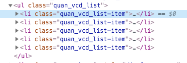

# 短视频滑动播放在 H5 下的实现

短视频已经无数不在了，但是主体还是使用 app 来承载的。本文讲述 H5 如何实现 app 的视频滑动体验。  
无声胜有声，一图顶百辩，且看下图：


从上图可以看到，我们主要实现的功能也是本文要讲解的有：

- 上滑查看新短视频
- 下滑查看历史短视频
- 滑动距离大于一个距离才上翻，否则归位
- 滑动有速率的概念，如果速率达到一定值，距离不够，也会翻页
- 自动播放的问题
- 如何保证当前视频的播放流畅度

## HTML + CSS 页面布局分析

页面布局采用 ul 布局，如下：



主要样式：

```CSS
.quan_vcd_list-item{
    width:100%;
    height:100vh;
    overflow:hidden;
    position:relative;
    -webkit-overflow-scrolling:touch;
}
.quan_vcd_list.trans{
    transition:transform .3s ease-out 0s,-webkit-transform .3s ease-out 0s;
}
video .video_hide{
    left:-100%;
}
```
video的html，其中两个三个重要点：  

- video需要先要将video移出屏幕外来达到隐藏的目的，如果用display:none的话，用户点击可能会出现异常。
- 设置playsinline，让视频在当前页面播放而不是全屏。
- x5-video-can-play-with-audio=true，且先执行播放音再播放视频。如果不设置这个值，那么在微信h5页面，会出现播放播放了视频，音频自动停止的场面。  

```html
<video
  x5-video-can-play-with-audio="true"
  :class="feedData.hide?'video_hide':''"
  :src="feedData.playurl"
  preload="auto"
  type="video/mp4"
  width="100%"
  webkit-playsinline="true"
  playsinline="true"
  loop="loop"
></video>
```

ul 是一个外层列表，宽度 100%即可。每一个视频项是一个充满屏幕的节点。本文不做重点讲述了，感兴趣可以自行尝试。
## js操作

监听用户手势，动态设置ul的translateY，然后执行音频和视频的播放。so easy!

### 手势滑动

手势滑动播放视频翻页，主要有两个条件：滑动距离和滑动加速度。

1. 初始化 Touch
   主要是重置参数，记录最后的位移，存储页面的高度。绑定 touch 事件。

```js
function Touch() {
  this.init();
}
Touch.fn = Touch.prototype;
Touch.fn.init = function(params) {
  this.lastY = this.translateY; //记录当前位移
  this.startY = 0;
  this.moveY = 0;
  this.lock = 0; //如果在回调或上升阶段不允许滑动.
  this.bodyHeight = window.innerHeight;
  this.resetLimitY();
  self.isIOS = /ip(?:hone|ad|od)/.test(navigator.userAgent.toLowerCase());
  ["touchstart", "touchmove", "touchend"].forEach(str => {
    document.addEventListener(this, this[str].bind(this));
  });
};
```

2. 监听手势的滑动

这里增加了一个 lock 变量，用于当滑动翻页的时候，页面处在翻页中的状态，需要锁死滑动，否则会错乱。  
lastY 是上一次滑动完之后的最终状态距离，translateY 是指滑动中的状态距离，需要实时变更 ul 的 translateY 的值

检测滑动的加速度：detectAcc

```js
var a = Math.abs(this.moveY) / (Date.now() - this.start) >= 0.5;
```

滑动的距离 大于 滑动的时间差的一半，则认为是主动翻页，需要执行翻页操作。

> 这里要注意点：ios 下再滑动过程中，可以立即执行翻页，体验很好，但是 android 不行,所以安卓需要等 touchend 之后再执行翻页

```js
Touch.fn.touchstart = function(e) {
  if (this.lock) return;
  this.startY = e.touches[0].pageY;
  this.start = Date.now(); //标识滑动起始时间，也用于标识滑动start
};
Touch.fn.move = function(y) {
  this.translateY = y;
};
Touch.fn.touchmove = function(e) {
  if (this.lock || !this.start) return; //锁定了，或者没有start，主要是手势一直滑动情况，已经加速度划走了，手势需要松开再重新开始
  this.moveY = e.touches[0].pageY - this.startY;
  this.move(this.moveY + this.lastY);
  this.detectAcc();
};
/**
 * 检测加速度
 */
Touch.fn.detectAcc = function(isEnd) {
  // console.log(self.moveY+"  "+(Date.now()-self.start));
  var a = Math.abs(this.moveY) / (Date.now() - this.start) >= 0.5;
  if (isEnd) {
    if (a) {
      this.limitY = 0;
    }
    this.movend();
    return;
  }
  if (this.isIOS && a) {
    //IOS，可以在touchmove时直接滑动，体验流畅。
    this.limitY = 0;
    this.movend();
  }
};
```

3. 处理翻页操作

设定翻页需要滑动的最小距离，这里需要大于 1/3 个屏幕高度。  
如果用户滑动的距离大于最小滑动距离，则翻页，否则执行归位。不管归位还是滑动翻页，都有一个 transition 的过程，这个过程我们不接受手势，所以需要等到位移结束之后，才重置 Lock 标识。  
这里还用到了动态拉取下下一个视频（我这里一次拉取两个视频），所以需要发出 eventsBus 事件，让接受该事件拉取新的视频。

```js
Touch.fn.resetLimitY = function () {
    this.limitY = this.bodyHeight/3;//位移多少才下滑
}
Touch.fn.touchend = function (e) {
    if(this.lock||this.moveY==0||!this.start) return;
    this.detectAcc(1);
}
Touch.fn.movend = function () {
    const self = this;
    this.lock = 1;
    /***
    * 最后上下位移小于最小值则还原为上一次位移，
    * 否则，那么就需要上移或下移一个body宽度，上移则translate加，下移在减去一个body
    * 这里是计算出了应该位移高度。
    */
    let transformY = Math.abs(self.moveY)<self.limitY?self.lastY:self.lastY+self.bodyHeight*(self.moveY>0?1:-1);

    /***
    * 还需计算最大下滑高度和最大上滑高度
    */
    let listUL = document.querySelector(".quan_vcd_list");
    let listHeight = listUL.getBoundingClientRect().height;

    //如果是最后一个li，则不能下滑，
    let maxBottom = (listHeight - self.bodyHeight)*-1;
    let lastComputeY = transformY>0?0:transformY<maxBottom?maxBottom:transformY;
    //停止滑动之后，自动滚动距离，transition
    listUL.classList.add('trans');
    if(lastComputeY<=0){
        let d = lastComputeY-self.lastY;
        d&&events.trigger("touch_move",d,(-lastComputeY/self.bodyHeight));
    }
    self.start = 0;
    (window.requestAnimationFrame|| window.webkitRequestAnimationFrame)(function () {
        self.move(lastComputeY);
        self.moveY = 0;
        self.lastY = lastComputeY;//记录确定的位置
        if(listHeight + self.lastY<=self.bodyHeight){
            events.trigger("turnPage");
        }
        setTimeout(function () {
            listUL.classList.remove("trans");
            self.lock = 0;
            self.resetLimitY();
        },500);
    });
```

### 注册视频组件

视频和背景音两种控制，如果视频执行 stalled 和 waiting 连续多次就代表视频卡住了，需要 show 出加载中的 loading 框。  
重点方法：onx5videoexitfullscreen 这个是 x5 浏览器在点击了全屏之后，再返回页面的时候，默认是视频 pause 的，所以需要 play

```js
export function videoComponent(opt) {
  var config = {
    props: ["feedData", "index"],
    data: function() {
      return {
        play_btn: 0,
        bg_name: "",
        anim_like: [],
        vloading: 0
      };
    },
    mounted:function(){
        this.addEvent();
        this.stall = 0;
        this.loaderror = 0;
    },
    methods: {
      onstalled: function() {
        if (!this.feedData.start) return;
        this.vloading = 1;
        this.play();
        this.stall++;
        if (this.stall == 2) {
          showTip("网络有点慢哦~");
          store.report(27, 1);
        }
      },
      waiting: function() {
        clearInterval(this.timer);
        this.loadTimes = 0;
        this.timer = setInterval(() => {
          this.loadTimes++;
          if (this.loadTimes >= 2) {
            //连续3次未播放，当作是卡住了
            this.aPause();
            this.vloading = 1;
          }
        }, 1800);
      },
      ondurationchange: function() {
        this.compute();
      },
      onloadedmetadata: function() {
        this.compute();
      },
      ontimeupdate: function() {
        this.timeupdate();
      },
      aPause: function() {
        this.audio && this.audio.pause();
      },
      aPlay: function() {
        this.audio && this.audio.play();
      },
      pause: function() {
        this.video.pause();
        this.aPause();
        this.vloading = 0;
        clearInterval(this.timer);
      },
      play: function(isMove) {
        this.videoPlay(isMove);
      },
      checkLoading: function() {
        checkLoading(this);
      },
      onx5videoexitfullscreen: function() {
        this.video.play();
      }
    }
  };
  Vue.component("video-com", util.assign(config, opt));
}
```
### 注册事件

注册video的事件，处理背景音乐，监听上面手势滑动的翻页事件。  

如果是微信环境，需要等待wx的api加载完成。在android微信里面是无法自动播放视频，否则可以自动播放视频。

```js
function addEvent() {
    this.$nextTick( ()=> {
        this.video = this.$el.querySelector("video");
        var arry = ['stalled','playing', 'timeupdate', 'abort', 'error','durationchange','loadedmetadata','pause','x5videoexitfullscreen'];
        arry.forEach( (str)=> {
            this.video.addEventListener(str,this['on'+str]);
        });
        if(this.index==0){
            this.loadWX(function (isWx) {
                if(isWx&&isAndroid) return;
                this.play();
            });
        }
    });
    this.handleBGM(this.feedData);
    let self = this;
    events.listen("touch_move", (direct,i)=> {
        handleMove(self,direct,i);
    });
}
function loadWX(cb) {
    if(device.scene=="weixin"){
        if(window.WeixinJSBridge){
            cb(true);
        }else{
            document.addEventListener("WeixinJSBridgeReady", function() {
                cb(true);
            });
        }
    }else{
        cb();
    }
}
```

### 预加载

预加载的前提是当前视频已经加载完成了，才能预加载下一个视频。需要标识每一个视频是否加载完成。  
- 如果当前视频没有加载完成，将会把预加载的视频都干掉，防止占用当前网络
- 如果当前视频已经加载完成，则一直预加载下一个，下下一个，对于网络好的尤为明显。

```js
function checkLoading() {
    let self = this;
    var interval = window.setInterval(getLoaded,100);
    // 获取视频已经下载的时长
    function getLoaded() {
        var end = 0;
        try {
            end = parseInt(self.video.buffered.end(0) || 0)+2;
        } catch(e) {
        }
        if(end>=self.duration){
            clearInterval(interval);
            self.loadedAll = 1;
            var nextItem = store.store.feedList[self.index+1];
            if(nextItem){//存在下一条
                //没有播放视频，既还没有加载完成。
                if(!nextItem.playurl) nextItem.playurl = nextItem.videourl;
                //有背景音乐，但是播放的背景音乐未加载完成，则开始加载
                if(!nextItem.bgmurl_p&&nextItem.bgmurl){
                    nextItem.bgmurl_p = nextItem.bgmurl;
                }
            }
        }
        return end
    }
}
```

### 滑动视频处理

滑动播放是关键，需要保证用户手势和执行播放需要是同步的，否则会出现部分手机播放失效，需要多点击一下播放。  

- 如果是当前视频，则需要播放当前视频和音频
- 需要停止还没有下载完的视频和音频（停止的做法就是将视频的url置空即可），否则影响当前播放的顺畅度。对于已经下载完的了则不需要处理。
- 同一个页面最大存在16个视频(ios的限制)，已当前视频为中心，上下保留七个视频，其余视频全部display:none

```js
function handleMove(self, direct, i) {
  if (i == self.index) {
    handleCurrent(self);
  }
  //direct>0 则是下滑,页面出现上一个视频，则当前位置的下一个视频要暂停，
  //direct<0则是上滑，页面要播放下一个视频了，则当前位置的上一个视频要暂停
  if (self.index == i + (direct > 0 ? 1 : -1)) {
    self.pause();
    if (!self.loadedAll) {
      feed.playurl = ""; //如果是未加载完成，那么就不要加载了。
      feed.start = 0;
      feed.hide = 1;
    }
    if (!self.audioLoaded) {
      feed.bgmurl_p = "";
    }
  }
  if (self.index >= i + 7 || self.index <= i - 7) {
    feed.maxHide = 1; //最大超过16个节点，则隐藏。
    feed.playurl = ""; //最大超过16个节点，则把其他视频干掉。
    feed.start = 0;
    feed.hide = 1;
  } else {
    feed.maxHide = 0;
  }
}
function handleCurrent(self){
    if (!self.feed.playurl) {
      self.feed.playurl = self.feed.videourl;
      if (!self.feed.bgmurl_p && self.feed.bgmurl) {
        self.feed.bgmurl_p = self.feed.bgmurl;
        self.audio.load();
      }
      self.video.load();
    }
    self.$nextTick(()=> {
      store.addPlayNum(feed.shareid);
      if (self.audio && !self.audioLoaded) {
        var int = setInterval(()=> {
          if (self.audioLoaded) {
            clearInterval(int);
            self.play(1);
          }
        }, 100);
      } else {
        self.play(1);
      }
    });
}
```

### 播放的Error

播放在不同的手机上可能会进入error（abort,error,stall）,我们需要自动再出发一次播放，这个能解决一部分手机二次播放的问题，会无缘无故进入error,导致视频无法播放。  

```js
function errors(msg) {
    let self = this;
    if(!self.video||!self.feedData.start) return;
    self.loaderror++;
    if(self.loaderror<=2){
        self.play();
        return;
    }
    setPlay(1);
    // report msg 
}
```